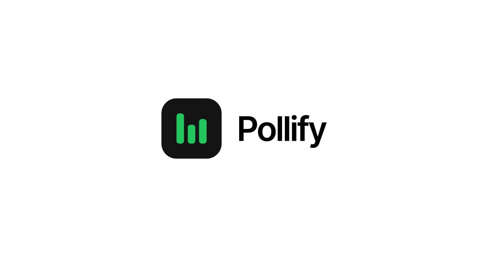

# Pollify


[](https://pollify-com.vercel.app/)


Pollify is a web app designed to make creating and sharing polls easy, interactive, and fun. Users can quickly create polls, participate in them, and view live results as votes come in. Built with **Next.js** for the frontend and **Hono** for the backend, Pollify is fast, modern, and user-friendly.

## ✨ Features

- 🔥 **Live Poll Results** – Watch votes update in real time
- 🔐 **Social Login** – Sign in with Google, Facebook, or Apple
- 🛡️ **Spam Protection** – Secure polls with reCAPTCHA v3 and IP-based protection
- 💎 **Advanced Analytics** – Track votes by country, device and trends
- 🌓 **Dark & Light Mode** – Switch between light and dark themes
- 💳 **Pricing Plans** – Access advanced features with Stripe integration
- 📊 **Vercel Analytics** – Track poll performance and user engagement
- 📲 **Easy Sharing** – Share polls with a link, social media, or QR code
- ♾️ **Infinite Scroll** – Browse large poll sets seamlessly
- 📥 **Data Export** – Download results as CSV or JSON

## 💻 Built with


## 🌍 Demo

[](https://pollify-com.vercel.app/)
[](https://pollify-com.vercel.app/api/health-check/)

## 🔍 Prerequisites

- NodeJS
- Bun
- Docker

## 📁 Project structure

The project is organized as a monorepo using Turborepo, with the following structure:

- `/apps`
  - [/api](./apps/api)
  - [/web](./apps/web)
- `/packages`
  - [/config](./packages/config)
  - [/eslint-config-custom](./packages/eslint-config-custom)
  - [/lib](./packages/lib)
  - [/prettier-config](./packages/prettier-config)
  - [/prisma](./packages/prisma)
  - [/tsconfig](./packages/tsconfig)
  - [/types](./packages/types)
  - [/ui](./packages/ui)
  - [/validation](./packages/validation)

## 🛠️ Installation Steps

1. Clone the repository

   ```bash
   git clone https://github.com/xkarol/pollify.git && cd pollify
   ```

2. Install dependencies

   ```bash
   bun install
   ```

3. Create `.env` file based on `.env.example`

4. Run docker compose

   ```bash
   docker compose up -d
   ```

5. Sync prisma schema

   ```bash
   bun turbo run db:push
   ```

6. Run the app

   ```bash
   bun dev
   ```
